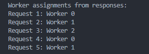
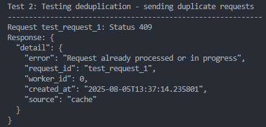
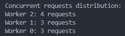

# Request Dispatcher API

A FastAPI-based request dispatcher that implements round-robin load balancing across 3 workers with request deduplication.

## Features

- **Round-Robin Load Balancing**: Distributes requests evenly across 3 workers
- **Request Deduplication**: Prevents the same request from being processed twice
- **Background Processing**: Uses FastAPI background tasks for async processing
- **Database Storage**: Stores all requests and results using SQLAlchemy


## Installation

1. Create a virtual environment:
```bash
# On Windows
python -m venv venv
venv\Scripts\activate

# On macOS/Linux
python3 -m venv venv
source venv/bin/activate
```

2. Install dependencies:
```bash
pip install -r requirements.txt
```

3. Run the API server:
```bash
python main.py
# or
uvicorn main:app --reload
```

The API will be available at `http://localhost:8000`

## API Endpoints

### POST /process-request

Process a new request with round-robin worker assignment.

**Request Body:**
```json
{
  "request_id": "abc123",
  "payload": {
    "some": "data"
  }
}
```

**Response (Success):**
```json
{
  "message": "Request queued for processing",
  "request_id": "abc123",
  "worker_id": 0,
  "created_at": "2024-01-01T12:00:00"
}
```

**Response (Duplicate):**
```json
HTTP 409 Conflict
{
  "detail": {
    "error": "Request already processed or in progress",
    "request_id": "abc123",
    "worker_id": 0,
    "created_at": "2024-01-01T12:00:00"
  }
}
```

## Testing

**⚠️ Caution**: For clean test results, you may need to delete the SQLite database file (`dispatcher.db`) before running tests to ensure a fresh start.

Run the test script to see round-robin distribution and deduplication in action:

```bash
# Make sure the server is running first
python main.py

# In another terminal, run the tests
python test_dispatcher.py
```
### 🧪 Test Results & Visualizations

#### 1️⃣ **Round-Robin Assignment (Sequential Requests)**
It shows how 5 SEQUENTIAL requests were assigned.

<p align="center">
  
</p>

#### 2️⃣ **Deduplication Check**
It shows duplication check works for duplicate request-id

<p align="center">
  
</p>

#### 3️⃣ **Concurrent Requests Distribution**
It shows how well requests are distributed in concurrent situation

<p align="center">
  
</p>
